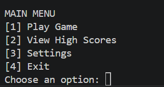
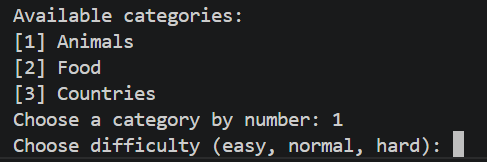
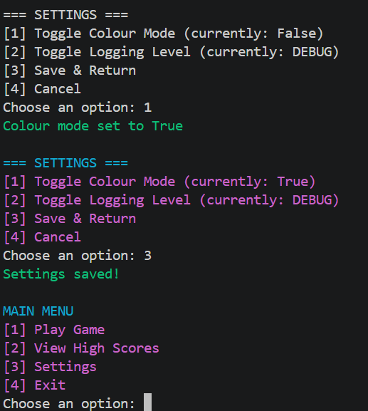
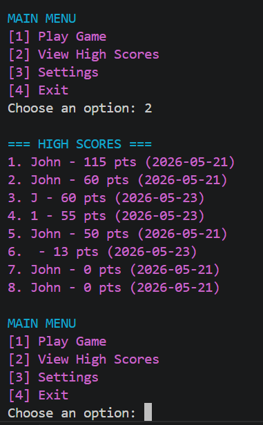

# 🎮 Guess The Word — Python Console Game

A simple but well‑structured word‑guessing game built in Python.  
The player selects a difficulty level and attempts to guess a hidden word one letter at a time.

This project is designed as a learning exercise in:

- Python fundamentals  
- Modular programming  
- Clean architecture  
- Refactoring  
- Testing with pytest  
- Git & GitHub workflow  

---

# ⭐ Current Release — Tier 2 (v2.0.0)

The project has evolved significantly beyond the original Tier 1 version.  
Tier 2 introduces major improvements to gameplay, architecture, and maintainability.

### ✔ New Tier 2 Features
- Difficulty‑based scoring system  
- Category‑based word selection  
- Configurable settings via `settings.json`  
- High‑score saving and loading  
- Logging system (`logs/game.log`)  
- Fully modular architecture (`ui/`, `gameplay/`, `persistence/`)  
- Expanded test suite (unit + integration tests)

### ✔ Documentation
Full Tier 2 documentation is available at:

```
docs/index.md
```

---

## 📦 Features

### Tier 2 Features (Current)
- Difficulty‑based scoring system  
- Category‑based word selection  
- Configurable settings via `settings.json`  
- High‑score saving and loading  
- Logging system  
- Modular architecture (UI, gameplay, persistence layers)  
- Full pytest suite (unit + integration tests)

### Tier 1 Features (Original)
- Two difficulty levels (Normal & Advanced)  
- Input validation (single letter, alphabet only, no repeats)  
- Words loaded from external JSON file  
- Fully documented with docstrings  
- Initial pytest test suite   

---

## 📁 Project Structure

```
project-root/
│
├── src/
│   ├── gameplay/
│   ├── ui/
│   ├── persistence/
│   └── game.py
│
├── data/
│   └── words.json
│
├── config/
│   └── settings.json
│
├── logs/
│   └── game.log
│
├── docs/
│   ├── index.md
│   └── tier2/
│       ├── scoring-design.md
│       ├── config-structure.md
│       └── logging-overview.md
│
├── tests/
│   └── (unit + integration tests)
│
└── README.md
```

---

## 🛠️ Installation

### 1. Clone the repository

```
git clone https://github.com/<your-username>/<your-repo>.git
cd <your-repo>
```

### 2. Create a virtual environment (recommended)

```
python -m venv venv
source venv/bin/activate   # macOS/Linux
venv\Scripts\activate      # Windows
```

### 3. Install dependencies

```
pip install pytest
```

---

## ▶️ Running the Game

From the project root:

```
python src/game.py
```

You will be prompted to:

- Enter your name  
- Choose a difficulty level  
- Guess letters until you win or run out of tries  

---

## 🖼️ Screenshots

### Tier 1 (Original Version)


### Tier 2 (Current Version)

  
  
  

---

## 🧪 Running Tests

All tests are located in the `tests/` folder.

Run them with:

```
pytest
```

---

## 📚 Future Development (Tier 2+)

This project will evolve into:

- A GUI version  
- A web version  
- An AI opponent  
- A full MVC architecture  
- Improved game loop  
- Additional word packs  

---

## 📘 Documentation

Full documentation for all tiers is available in:

[docs/index.md](docs/index.md)

---

## 👤 Author

**John Razak**  
University project — 2026