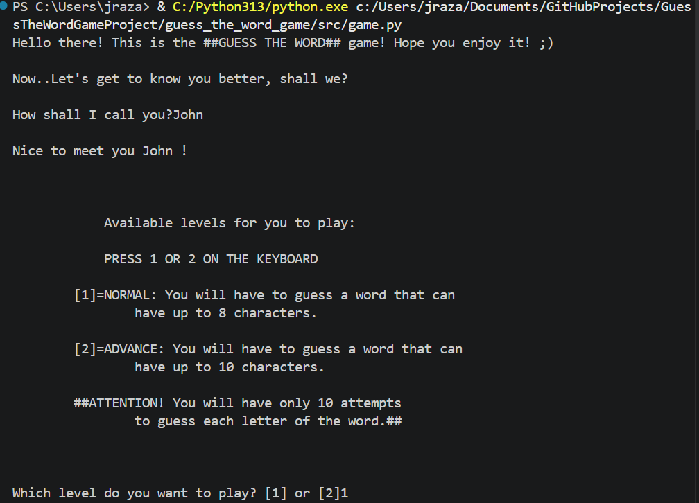
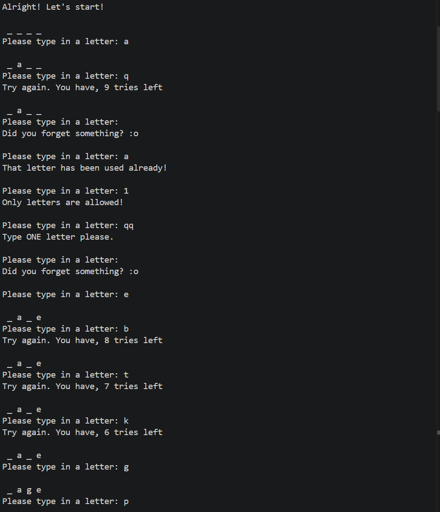
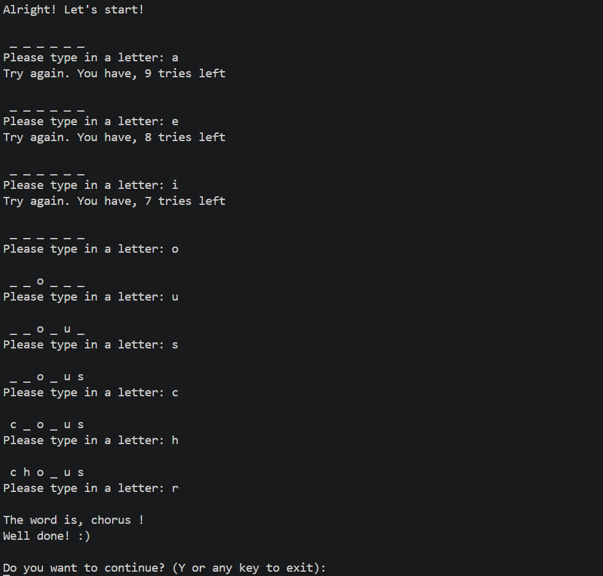

# 🎮 Guess The Word — Python Console Game

A simple but well‑structured word‑guessing game built in Python.  
The player selects a difficulty level and attempts to guess a hidden word one letter at a time.

This project is designed as a learning exercise in:

- Python fundamentals  
- Modular programming  
- Clean architecture  
- Refactoring  
- Testing with pytest  
- Git & GitHub workflow  

---

## 📦 Features

- Two difficulty levels (Normal & Advanced)  
- Input validation (single letter, alphabet only, no repeats)  
- Modular architecture with reusable functions  
- Words loaded from external JSON file  
- Fully documented with docstrings  
- Pytest test suite (Tier 1 requirement)  

---

## 📁 Project Structure

```
project-root/
│
├── src/
│   └── game.py
│
├── data/
│   └── words.json
│
├── tests/
│   ├── test_input_validation.py
│   ├── test_word_selection.py
│   └── test_display_update.py
│
└── README.md
```


---

## 🛠️ Installation

### 1. Clone the repository

```
git clone https://github.com/<your-username>/<your-repo>.git
cd <your-repo>
```

### 2. Create a virtual environment (recommended)

```
python -m venv venv
source venv/bin/activate   # macOS/Linux
venv\Scripts\activate      # Windows
```

### 3. Install dependencies

```
pip install pytest
```

---

## ▶️ Running the Game

From the project root:

```
python src/game.py
```

You will be prompted to:

- Enter your name  
- Choose a difficulty level  
- Guess letters until you win or run out of tries  

---

## 🖼️ Screenshots

### Game Startup


### Gameplay Example


### Win Screen


---

## 🧪 Running Tests

All tests are located in the `tests/` folder.

Run them with:

```
pytest
```

---

## 📚 Future Development (Tier 2+)

This project will evolve into:

- A GUI version  
- A web version  
- An AI opponent  
- A full MVC architecture  
- Improved game loop  
- Additional word packs  

---

## 👤 Author

**John Razak**  
University project — 2026